% Coordinació TIC
% Alfons Rovira
% Alzira, 20 de setembre de 2019

# 1. Gestió d'incidències TIC

## Formulari

1. Nom
2. Lloc
3. Contingut

## Lloc

Cal deixar el paper a la safata TIC de la **sala de reunions**.

# 2. Instruccions de principi de curs

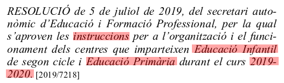

# 3. Sistema de comunicació

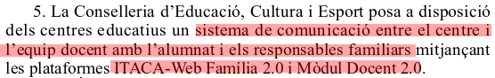

# 4. Informació al núvol

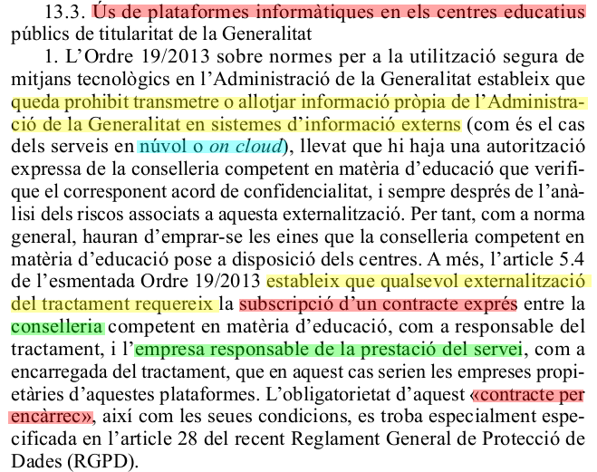

# 5. Xarxes socials

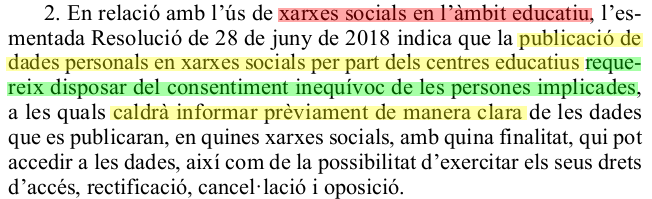

# 6. Ús de dades a les xarxes socials

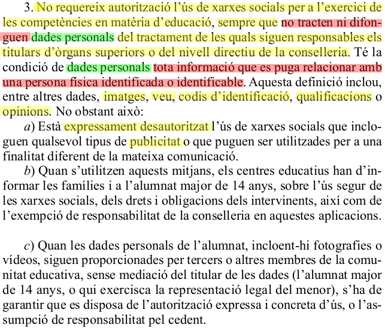

# 7. Comunicacions

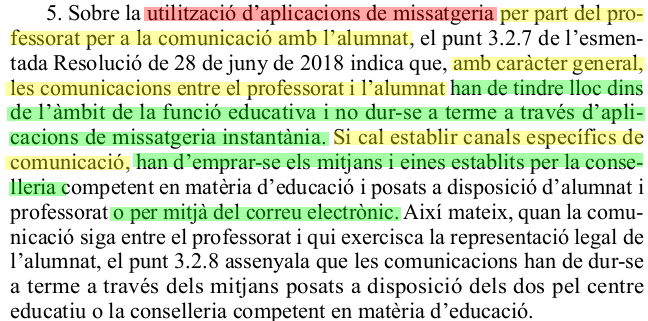

# 8. Comunicacions /2

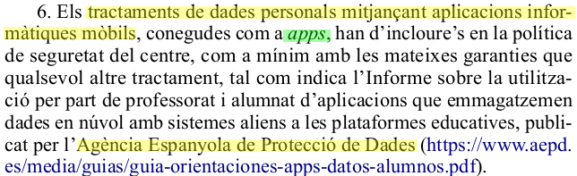

# 9. Utilització d'Apps

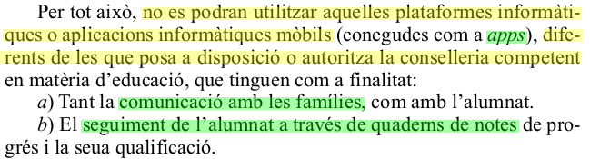

# 10. Correu electrònic

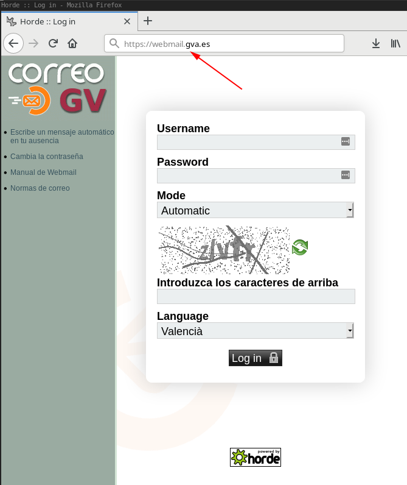

# 11. Moodle per a tots

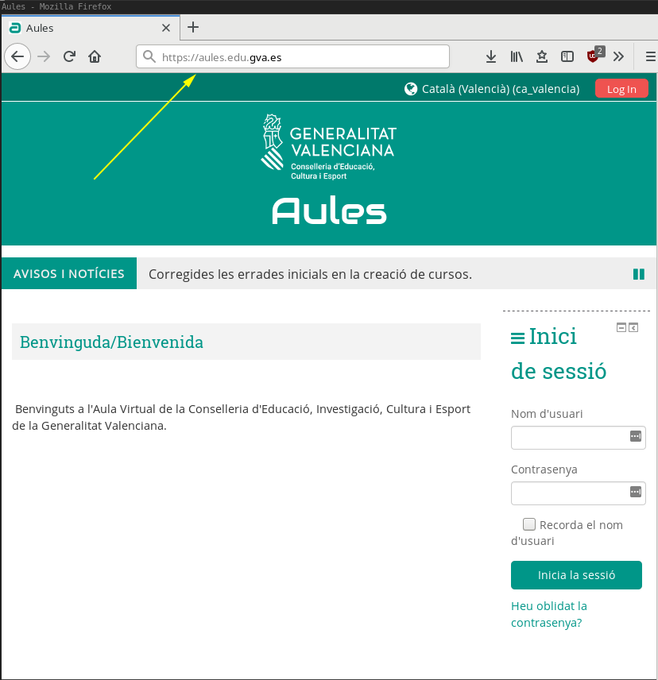

# 12. Llicència

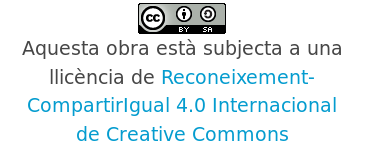
